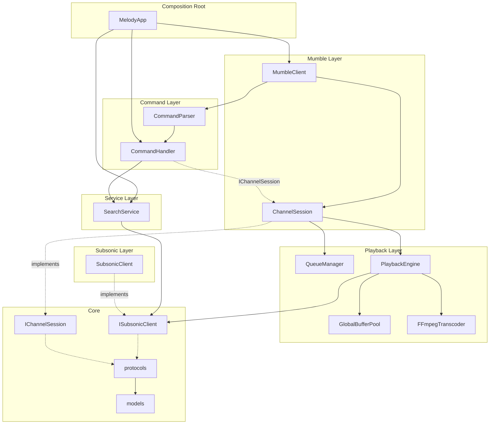

# Melody

A production-quality Mumble music bot that streams music from any **Subsonic-compatible** backend (Navidrome, Airsonic, Gonic, Jellyfin Subsonic plugin, and others). Each Mumble channel gets its own independent queue and playback session.

## Features

- Per-channel queues with history, repeat, and shuffle
- Real-time streaming via Subsonic `stream.view` — tracks are never fully downloaded
- FFmpeg transcoding to Mumble-compatible PCM (48 kHz, 16-bit stereo)
- Bounded rolling buffer for slow stream startup (e.g. Octo Fiesta behind Navidrome)
- Multi-channel support — bot joins channels on demand
- Auto-disconnect when channels are empty
- Configurable command prefixes (`m/`, `melody/`, `/`, etc.)

## Architecture

Dependencies flow **one way** — outer layers depend on inner layers; nothing imports upward.



### Dependency rules

| Layer | May import from |
|-------|-----------------|
| **Core** (`models`, `protocols`, `config`, `logging`) | stdlib only |
| **Subsonic** | Core |
| **Playback** | Core, Subsonic protocols |
| **Services** | Core, Subsonic |
| **Commands** | Core, Services, Protocols |
| **Mumble** | Core, Playback, Commands, Subsonic protocols |
| **App** | All layers (composition root) |

No layer imports from Mumble or App. Commands talk to sessions through `IChannelSession`, not concrete `ChannelSession`.

### Components

| Component | Responsibility |
|-----------|----------------|
| **MumbleClient** | Connects to Mumble, routes chat commands, bridges pymumble thread to asyncio |
| **ChannelSession** | Per-channel queue, playback, grace disconnect timer |
| **CommandParser** | Parses prefixed chat commands and options |
| **CommandHandler** | Executes commands via `IChannelSession` and `SearchService` |
| **SearchService** | Resolves queries to ranked Subsonic matches |
| **QueueManager** | History, current track, upcoming queue, repeat/shuffle |
| **PlaybackEngine** | Streams from Subsonic, buffers, transcodes via FFmpeg, sends PCM |
| **ISubsonicClient** | Backend-agnostic Subsonic API interface (in `protocols`) |
| **SubsonicClient** | aiohttp implementation for any Open Subsonic server |

### Audio pipeline

1. HTTP stream from Subsonic `stream.view` (chunked, not fully downloaded)
2. Rolling buffer until `AUDIO_BUFFER_START_SECONDS` of audio is available
3. FFmpeg transcodes encoded audio → s16le 48 kHz stereo PCM
4. PCM frames sent to Mumble via pymumble

## Supported Subsonic backends

Melody uses the standard Open Subsonic REST API and works with any compatible server:

- [Navidrome](https://www.navidrome.org/) (primary target, including behind Octo Fiesta)
- [Airsonic-Advanced](https://github.com/airsonic-advanced/airsonic-advanced)
- [Gonic](https://github.com/sentriz/gonic)
- [Jellyfin](https://jellyfin.org/) (Subsonic plugin)
- Other Open Subsonic-compatible servers

No Navidrome-specific code is used.

## Requirements

- Python 3.12+
- FFmpeg
- libopus (required by pymumble for audio encoding)

## Docker deployment

1. Copy the example environment file:

```bash
cp .env.example .env
```

2. Edit `.env` with your Mumble and Subsonic credentials.

3. Start the bot:

```bash
docker compose up -d
```

4. View logs:

```bash
docker compose logs -f melody
```

The container runs as a non-root `melody` user, includes FFmpeg, and stores temporary audio buffers in `/tmp/melody-buffer`.

## Local development

```bash
python -m venv .venv
# Windows
.venv\Scripts\activate
# Linux/macOS
source .venv/bin/activate

pip install -e ".[dev]"
cp .env.example .env
# Edit .env with your settings

python -m melody
```

Run tests:

```bash
pytest
```

## Environment variables

| Variable | Required | Default | Description |
|----------|----------|---------|-------------|
| `SUBSONIC_URL` | Yes | — | Base URL of Subsonic server (e.g. `https://music.example.com`) |
| `SUBSONIC_USERNAME` | Yes | — | Subsonic username |
| `SUBSONIC_PASSWORD` | Yes | — | Subsonic password |
| `MUMBLE_HOST` | Yes | — | Mumble server hostname |
| `MUMBLE_PORT` | No | `64738` | Mumble server port |
| `MUMBLE_USERNAME` | Yes | — | Bot username on Mumble |
| `MUMBLE_PASSWORD` | No | `""` | Mumble server password |
| `MUMBLE_TLS` | No | `false` | TLS flag (see troubleshooting) |
| `COMMAND_PREFIXES` | No | `m/,melody/,/` | Comma-separated command prefixes |
| `DISCONNECT_GRACE_PERIOD` | No | `300` | Seconds before leaving empty channels |
| `AUDIO_BUFFER_MAX_MB` | No | `256` | Max buffer size across all streams |
| `AUDIO_BUFFER_START_SECONDS` | No | `3` | Min buffer before playback starts |
| `LOG_LEVEL` | No | `INFO` | Log level (`DEBUG`, `INFO`, `WARNING`, `ERROR`) |

## Commands

Commands are sent as Mumble text chat messages with a configured prefix.

| Command | Description |
|---------|-------------|
| `play [options] [query]` | Stop current playback, clear queue, search, play best match |
| `queue [options] [query]` | Search and add to queue; starts if idle |
| `stop` | Stop playback, clear queue and history |
| `pause` | Pause playback |
| `resume` | Resume playback |
| `next` | Skip to next track |
| `back` | Return to previous track |
| `quit` / `exit` | Stop, leave channel, destroy session |

### Options

| Option | Description |
|--------|-------------|
| `-t`, `--track` | Search tracks only (default when no type is specified) |
| `-p`, `--playlist` | Search playlists only |
| `-r`, `--repeat` | Enable repeat (track or playlist) |
| `-s`, `--shuffle` | Shuffle upcoming queue |

Options may appear before or after the query.

### Examples

```
m/play never gonna give you up
melody/queue --playlist workout
/play -t queen bohemian rhapsody
m/queue -r -s rock classics
/stop
m/next
melody/back
/quit
```

## Troubleshooting

### `ffmpeg not found in PATH`

Install FFmpeg and ensure it is on your `PATH`. The Docker image includes FFmpeg automatically.

### `Could not find opus library`

Install libopus:

```bash
# Debian/Ubuntu
sudo apt install libopus0

# macOS
brew install opus
```

### Slow stream startup (Octo Fiesta / Navidrome)

Some backends delay the first bytes of a stream. Increase pre-buffer time:

```
AUDIO_BUFFER_START_SECONDS=5
```

If streams still fail, check Subsonic logs and verify `stream.view` works in a browser with the same credentials.

### Mumble connection denied

- Verify `MUMBLE_HOST`, `MUMBLE_PORT`, and `MUMBLE_PASSWORD`
- Ensure the bot username is allowed on the server
- Some servers require a registered certificate for the bot user

### `MUMBLE_TLS`

pymumble connects over plain TCP by default. If your server requires TLS, you may need a TLS-terminating proxy or connect to a non-TLS port. Set `MUMBLE_TLS` for future compatibility; check your Mumble server documentation for the correct port.

### Subsonic authentication errors

- Verify `SUBSONIC_URL` has no trailing slash (automatically stripped)
- Confirm username/password work via the server's web UI
- For Jellyfin's Subsonic plugin, use your Jellyfin credentials

### Bot leaves channel unexpectedly

When no human users remain in a channel, the bot starts a grace timer (`DISCONNECT_GRACE_PERIOD`). After it expires, playback stops and the bot leaves. Join the channel again and send a command to bring it back.

## License

MIT — see [LICENSE](LICENSE).
